# tiny-chat

Inspired by [tinyprojects.dev](https://tinyprojects.dev/) I wanted to build a very simplified browser room client. The goal is not to monetize anything but to double check that I am not missing any of the skills involved in doing so.

## What I am trying out in this project (+ lessons learned)

### General

- experiment with new new project file structure and naming convention

### Backend

- `fastify` as a webserver
  - (+) built-in logging, schema-based validation, websocket support
  - (+) plugin system enables nicely modularized code
  - (?) the built-in test functionality with `fastify.inject` looks like an interesting middleground between unit tests and tests with a running server. It feels like I am duplicating my integration tests without getting the assurance of having tested actually calling my API, so I skipped it for now.
    (-) fastify's websocket integration only seems to support the native `message` event and not custom events like the underlying `ws` library does
- only write integration tests (skip unit tests) to see whether this is a decent compromise for prototyping
  - (+) makes it very easy to shift around things
  - (-) finding reason for a single test failing can be a bit more tedious
- design the chat API via messages within the websocket connection
  (-) feels a bit hacky as of now as I am implementing some of the nuts and bolts (serialization, validation) more manually than I would for REST.
  (-) cannot leverage input/schema validation of `fastify`
- delay persistence layer implementation as long as possible
  (+) allows for collecting all the requirements before assessing what's the best fit

### Frontend (Browser/React)

- Try to work without state library for simplicity
  - Use class to keep websocket-related state
  - subscribe root component to changes and persist them via `useState`
  - drill down states to child components
  - obviously ineffecient as a lot of unnecessary rerenders are triggered; could be improved by memoization of different components

## Requirements

- Users can generate room with unique, generated room_id
  - Persistence
    - room_id can be key and/or prefix in a key/value store
  - Cleanup
    - Delete if room idle, e.g. after 5 min
    - Maximum TTL, e.g. 12h
  - Limits
    - channels by user (requires authentication, e.g. via SSO)
- Users can join existing room with room_id
  - Persistence
    - List of current users for each room
- Users can exit room with room_id
- Users can send text to room
  - Limits
    - length of message, e.g. 1000 UTF-8 characters
    - number of users in channel, e.g. 500
- All users see a consistent version of the room
  - Persistence
    - Messages needs to be ordered in some centralized data structure to avoid clients seing different versions of the room
- Messages are guaranteed to be sent by the displayed users
  - sign messages with assymetric keys and verify signatures in backend
    - send public key to backend when joining a room; backend can save this and verify signatures of each message to guarantee authenticity
    - sign messages with private key
    - reject unsigned or invalidly signed messages
- Users see room history
  - Limits
    - max x messages in room history

## Basic module outline

```mermaid
graph TD
    subgraph create[chat/create]
      client-create["Client<br>-save $room_id"]
      client-create --> |"- create_room(): ($room_id)"| create-module
      create-module["create-module"]
      create-module --> |"- save $room_id"| db-create
      db-create["DB<br>$room_id"]
    end
    subgraph join[chat/join]
      client-join["Client<br>- save ($user_id, $user_name)"]
      client-join --> |"- join_room($room_id,$user_name,$pub_key): ($user_id, $user_name) "| join-module
      join-module["join-module<br>- create $user_id from $user_name"]
      join-module -->|"- save $pub_key,$user_id<br>on join_room<br>"| db-join
      db-join["DB<br>- $user_id <=> $pub_key<br>$room_id <=> $user_id"]
    end
    subgraph message[chat/message]
      client-msg["Client<br>- sign $msg with $msg_sig<br>- display $msgs and update to latest $last_msg_id<br>"]
      client-msg --> |"- send_msg($room_id, $user_id, $msg, $msg_sig): ()<br>- fetch_msgs($last_msg_id_1): ($last_msg_id_2)"| message-module
      message-module["message-module<br>- verify_msg_sig"]
      message-module -->|"- fetch $pub_key for verify_msg_sig<br>- save (verified) $msg<br>- fetch $msgs since"| db-msg
      db-msg["DB<br>- $room_id <=> $msg[n]"]
    end
```

## MVP

- Only one global room => no need for `creation-module` yet
- No horizontal scaling and no resilience to backend restarts => persistence can be restricted to in-memory
