# tiny-chat

Inspired by [tinyprojects.dev](https://tinyprojects.dev/) I wanted to build a very simplified browser chat client. The goal is not to monetize anything but to double check that I am not missing any of the skills involved in doing so.

## Requirements

- Users can generate chat with unique, generated room_id
  - Persistence
    - room_id can be key and/or prefix in a key/value store
  - Cleanup
    - Delete if room idle, e.g. after 5 min
    - Maximum TTL, e.g. 12h
  - Limits
    - channels by user (requires authentication, e.g. via SSO)
- Users can join existing chat with room_id
  - Persistence
    - List of current users for each room
- Users can send text to room
  - Limits
    - length of message, e.g. 1000 UTF-8 characters
- All users see a consistent version of the chat room
  - Persistence
    - Messages needs to be ordered in some centralized data structure to avoid clients seing different versions of the chat
- Messages are guaranteed to be sent by the displayed users
  - sign messages with assymetric keys and verify signatures in backend
    - send public key to backend when joining a room; backend can save this and verify signatures of each message to guarantee authenticity
    - sign messages with private key
    - reject unsigned or invalidly signed messages
- Users see chat history
  - Limits
    - max x messages in chat history

## Basic module outline

```mermaid
graph TD
    subgraph create[create-room-module]
      client-create["Client<br>-save $room_id returned by create_room"]
      client-create --> |"- create_room()"| create-module
      create-module["create-room-module"]
      create-module --> |"- save $room_id"| db-create
      db-create["DB<br>map[$room_id,?] (will be used for msgs)"]
    end
    subgraph join[join-room-module]
      client-join["Client<br>- save $unique_user_name<br>returned by join_room"]
      client-join --> |"- join_room($room_id,$user_name,$pub_key) "| join-module
      join-module["join-module<br>- create $unique_user_name from $user_name"]
      join-module -->|"- save $pub_key,$unique_user_name<br>on join_room<br>"| db-join
      db-join["DB<br>- map[$unique_user_name,$pub_key]<br>- map[$room_id,$unique_user_name]"]
    end
    subgraph message[message-room-module]
      client-msg["Client<br>- sign $msg with $msg_sig<br>- display $msgs and save $last_msg_id<br>"]
      client-msg --> |"-send_msg($room_id, $unique_user_name, $msg, $msg_sig)<br>- fetch_msgs($last_msg_id)"| message-module
      message-module["message-room-module<br>- verify_msg_sig"]
      message-module -->|"- fetch $pub_key for verify_msg_sig<br>- save (verified) $msg<br>- fetch $msgs since"| db-msg
      db-msg["DB<br>- map[$room_id,$msg[n]]"]
    end
```

## MVP

- Only one global room => no need for `creation-module` yet
- No horizontal scaling and no resilience to backend restarts => persistence can be restricted to in-memor

## Implementation choices

- Simple REST endpoints for channel creation
- Chat client can communicate with backend via websocket as we can leverage push and pull between client and backend as frequent communication is necessary anyway.
